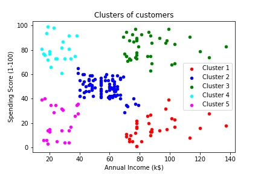

# Customers Segmentation

In this project I have tried to demonstrate the use of Machine Learning in businesses for profit enhancement.

Unsupervised Learning(Clustering) is used to find the hidden data patterns or structures which can be used by an organization(like mall, shopping complexes etc) to target the right audience and hence increase profit margin.

In this study, k-means and agglomerative models were used. The performance and accuracy of both models were good.

The features in the dataset are explained below :

1. Customer ID - It is the unique ID assigned to the customer 
2. Gender - Gender of the customer
3. Age - Age of the customer(in years)
4. Annual Income(k$) - Annual income of the customer in k$
5. Spending Score - Score assigned to the customer by the mall/shopping complex based on the customer spending nature and behavior